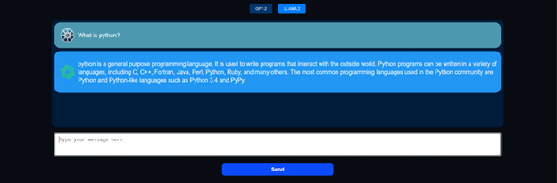

# Chatbot with GPT-2 and LLAMA 2

This project is a Flask-based web application that serves a chatbot powered by GPT-2 and LLAMA 2 models. Users can interact with the chatbot via a simple web interface and choose between the two models for generating responses.

## Features

- **GPT-2 Model**: Generates responses using the GPT-2 model from Hugging Face.
- **LLAMA 2 Model**: Generates responses using the LLAMA 2 model from Hugging Face Hub.
- **Flask Framework**: Simple web interface built with Flask.
- **API Endpoint**: Allows interaction with the chatbot through a POST request.

## Code Structure

### app.py

The main script that initializes the Flask app, loads the models, defines the routes, and handles the logic for generating responses.

### templates

This folder contains the HTML templates for rendering the web pages.

### static

This folder contains static files such as CSS, JavaScript, and assets (images, fonts, etc.).

## Installation and Usage

1. **Clone the Repository**: Clone this repository to your local machine.
2. **Navigate to the Project Directory**: Move into the project directory.
3. **Installation**: To run this project, you need to have Python 3.10.12 installed. It's recommended to use Anaconda to create a virtual environment. Follow the steps below to set up the environment and install the dependencies:

   a. **Create a Virtual Environment**:

   ```sh
   conda create -n chatbot-env python=3.10.12
   conda activate chatbot-env
   ```

   b. **Install the Requirements**: Run the following command to install all the necessary packages:

   ```sh
   pip install -r requirements.txt
   ```

4. **Run the Flask App**: Start the Flask application using the command:

   ```sh
   python app.py
   ```

5. **Access the Application**: Open your web browser and navigate to `http://127.0.0.1:5000/` to use the chatbot.

## API Endpoint

The application exposes a single API endpoint for generating responses from the chatbot.

### POST `/api`

- **Request**: JSON payload with `message` and optional `model` (either `"gpt2"` or `"llama2"`).
- **Response**: JSON response containing the generated text.

Example request:

```json
{
  "message": "Hello, how are you?",
  "model": "gpt2"
}
```

Example response:

```json
{
  "response": "I'm good, thank you! How can I assist you today?"
}
```

## How It Works

### Model Loading

The application loads the GPT-2 and LLAMA 2 models during startup. The GPT-2 model is loaded using the `transformers` library, and the LLAMA 2 model is loaded from the Hugging Face Hub.

### Response Generation

- **GPT-2**: The prompt is tokenized, and the model generates a response, which is then decoded and returned.
- **LLAMA 2**: The prompt is formatted, and the model generates a response which is parsed to extract the assistant's reply.

### Error Handling

The application includes error handling for bad requests and internal server errors, returning appropriate JSON responses.

## Screenshots

Below are some screenshots of the final product. Replace the paths with the actual paths to your images.

### Chat Interface


### Response

#### GPT-2 Response



#### Llama 2 Response


